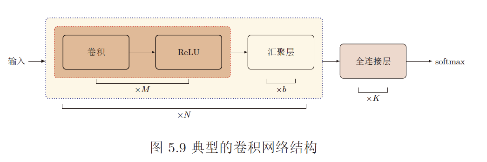
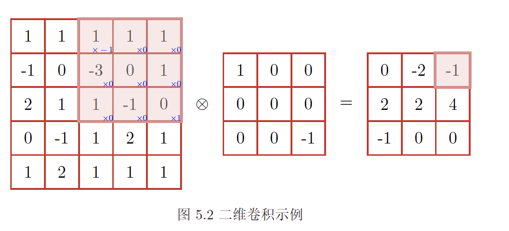
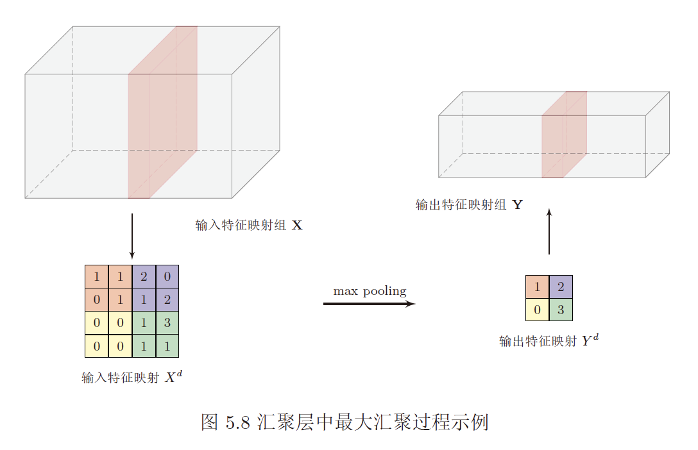
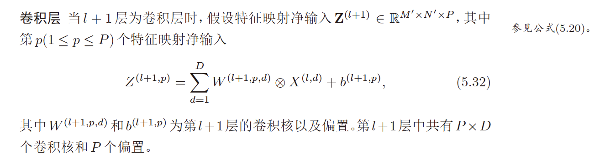
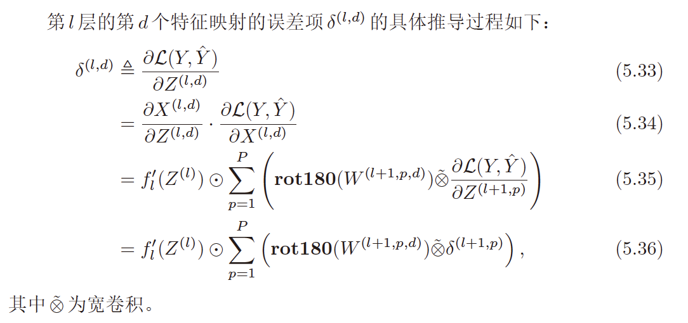
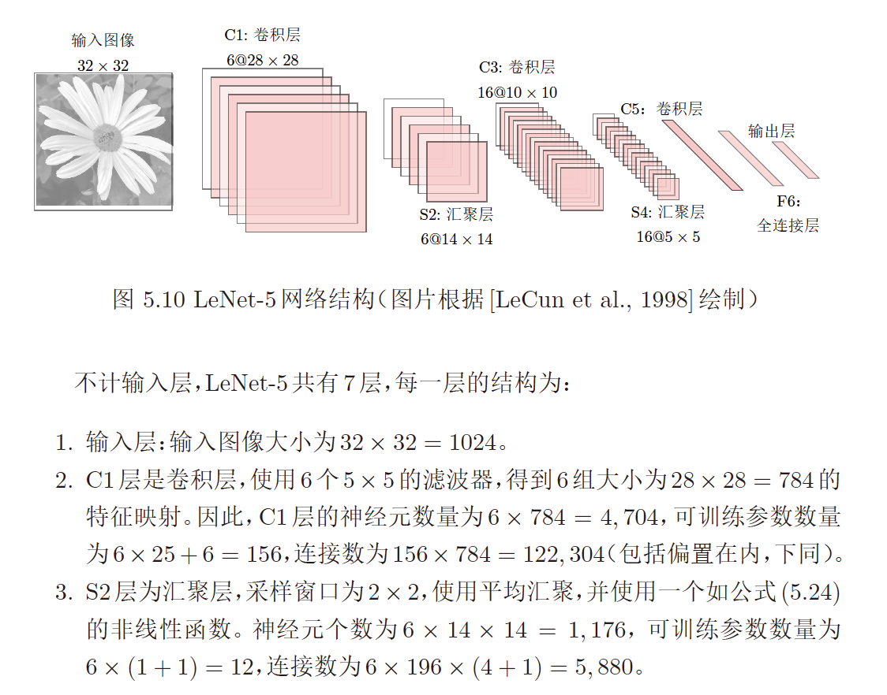
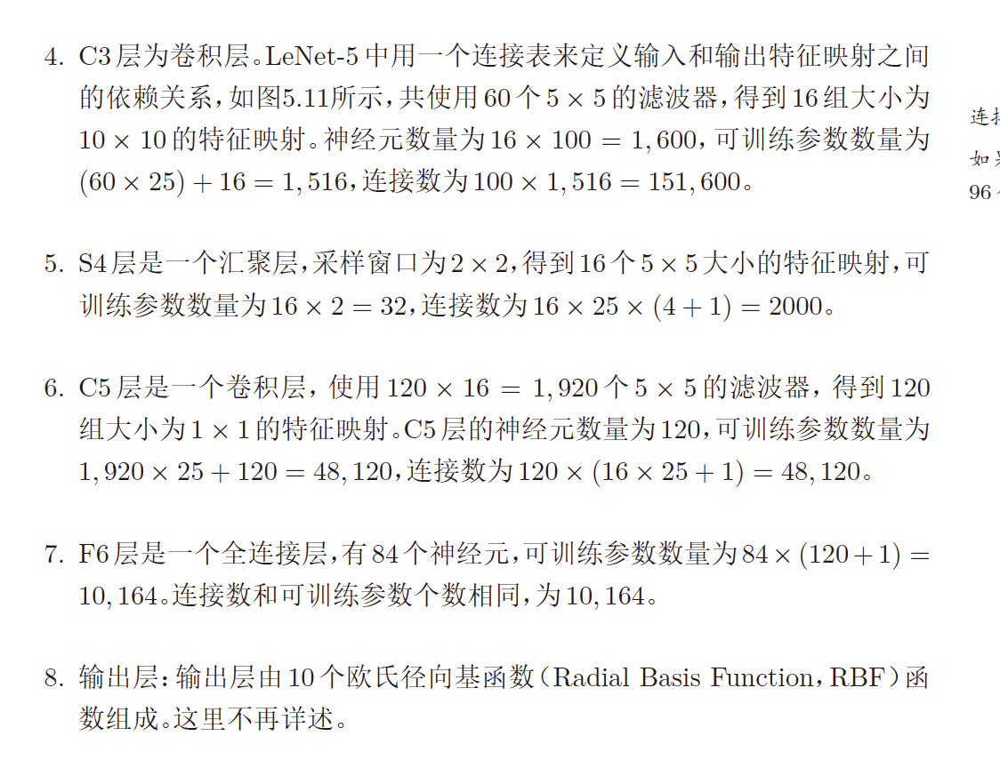

# 第五章 卷积神经网络
>   

---
## 1. 基本概念
### 1.1 卷积
  - 窄卷积,输出n-m+1
  - 宽卷积,输出n+m-1
  - 等宽卷积,输出n   
>   

### 1.2 互相关
- 与卷积的区别是卷积核不翻转   

---
## 2. 前馈神经网络，误差反向传播
### 2.1 卷积层
- 卷积核
  - 提取局部区域的特征
  - 在同一层使用不同卷积核可以提取到多个不同特征   

- Feature Map
  - 经卷积核提取后的特征图

### 2.2 汇聚层/池化层
- 进行特征选择，减少参数数量
  - Maximun Pooling 取采样区域内的最大值作为该区域的值
  - Mean pooling 取采样区域内的平均值作为该区域的值   
  >   

### 2.3 全连接层   

---
## 3. 结构特性
  - 局部连接   
    上一层神经元只与卷积核窗口内神经元相连
  - 权重共享   
    卷积核对一层所有神经元权重共享
  - 汇聚   

---
## 4. 参数学习
### 4.1 卷积核权重
- 计算损失函数对权重的梯度   

### 4.2 卷积核偏置
- 计算损失函数对偏置的梯度   

### 4.3 误差项计算
- 汇聚层/池化层
  * 最大池化   
      + 误差项回传时，传到上一层池化区域内最大值对应的神经元，其他神经元误差为0
  * 平均池化   
      + 误差项回传时，平均传到上一层池化区域内，所有神经元误差相同
- 卷积层
>   
>   

## 5. 几种典型的CNN
### 5.1 LeNet-5
>
>
