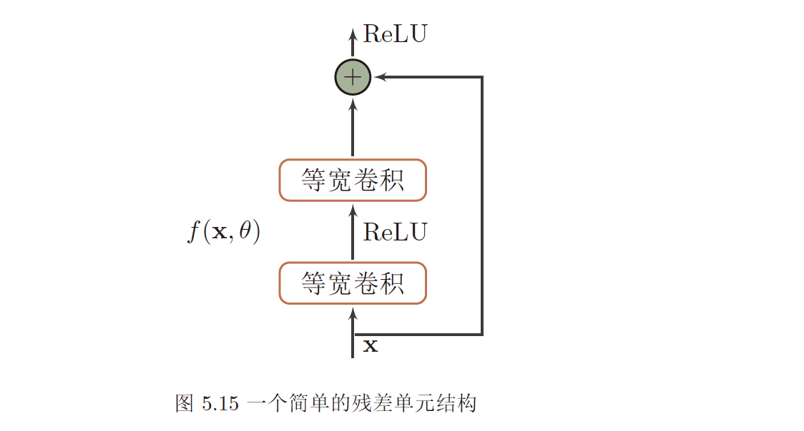

# 第五章 卷积神经网络
>   

---
## 1. 基本概念

### 1.1 卷积
**卷积核**可以看作是对对应区域内的加权求和，对应局部感知，卷积核区域大小叫感受野。
  - 窄卷积,输出n-m+1
  - 宽卷积,输出n+m-1
  - 等宽卷积,输出n   

> **二维卷积过程**如下，假设卷积层的输入神经元个数为n，卷积核大小为m，步长（stride）为s，   
输入 神经元两端各填补p个零（zero padding），那么该卷积后输出的神经元数量为(n−m+2p)/s+1。   

>   

  - 其他卷积形式
    * 转置卷积（反卷积），从低维度向高维度变的
    * 微步卷积，向低维度数据中间插入0，然后再卷积，可以提高数据维度
    * 空洞卷积（膨胀卷积），向卷积核中插入空洞，变相增加卷积核大小，提高了感受野，但是没有增加参数量

### 1.2 互相关
- 与卷积的区别是卷积核不翻转   

---
## 2. 卷积神经网络-前馈神经网络，误差反向传播   

### 2.1 卷积层
- 卷积核
  - 决定感受野大小
  - 提取局部区域的特征
  - 在同一层使用不同卷积核可以提取到多个不同特征   

- Feature Map
  - 经卷积核提取后的特征图

### 2.2 汇聚层/池化层
- 进行特征选择，减少参数数量
  - Maximun Pooling 取采样区域内的最大值作为该区域的值
  - Mean pooling 取采样区域内的平均值作为该区域的值   
  >   

### 2.3 全连接层   

---
## 3. 结构特性
  - 局部连接   
    上一层神经元只与卷积核窗口内神经元相连
  - 权重共享   
    卷积核对一层所有神经元权重共享
  - 汇聚   

---
## 4. 参数学习
### 4.1 卷积核权重
- 计算损失函数对权重的梯度   

### 4.2 卷积核偏置
- 计算损失函数对偏置的梯度   

### 4.3 误差项计算
- 汇聚层/池化层
  * 最大池化   
      + 误差项回传时，传到上一层池化区域内最大值对应的神经元，其他神经元误差为0
  * 平均池化   
      + 误差项回传时，平均传到上一层池化区域内，所有神经元误差相同
- 卷积层
>   
>   

## 5. 几种典型的CNN
  - **LeNet-5**
>
>   

  - **AlexNet**
    * 首次采用GPU训练
    * 采用ReLU激活
    * 使用Dropout 防止过拟合
    >
    >   
    注：图5.12中最左边224应该为227   
  - **Inception网络**
      * 由Inception 模块和少量池化层堆叠而成
      * GoogleNet 有9个Iception模块，5个池化层和其他卷积层和全连接层组成
      * Inception v3把大卷积核换成小卷积核
      * **1x1卷积核**的作用：
        + 当卷积核数量比输入的通道数少(多)时，能起到降维(升维)的作用  
        + 其降维或升维的本质是在通道间将信息线性组合变化，增加通道间的信息交互
        + 在保持feature map尺寸不变的情况下，大幅增加非线性特性，可以把网络做得更深
      >   

  - **ResNet 残差网络**
      * 把目标函数拆分为恒等函数和残差函数，让神经网络去学习残差函数，比直接学习目标函数更容易
      >   
      >   

(第五章完结)
